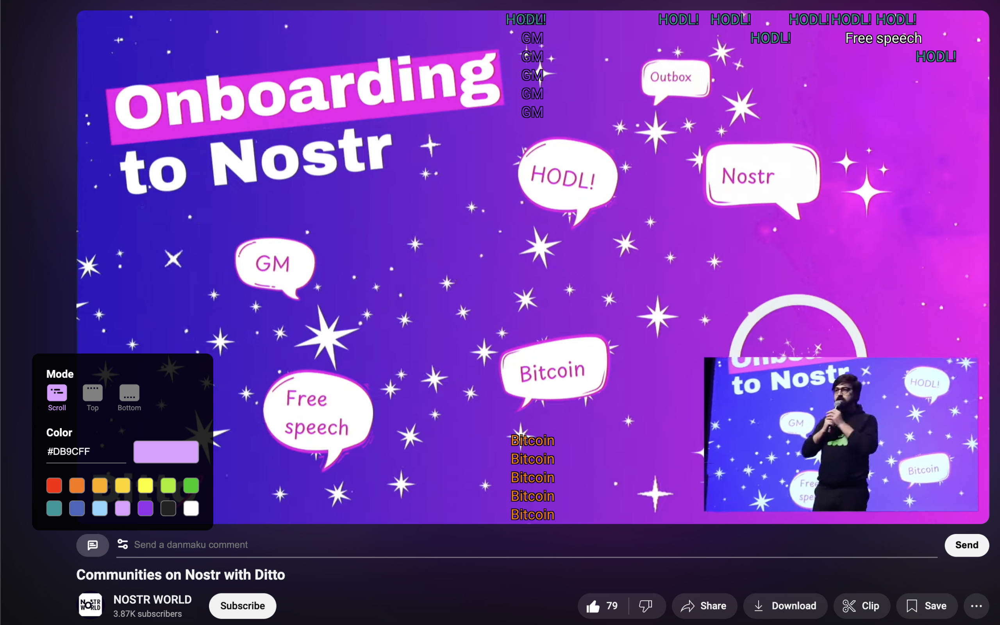

# danmakustr

> 一个基于 [nostr 协议](https://nostr.com/)的 chrome 弹幕插件
> a chrome extension for danmaku based on [the nostr protocol](https://nostr.com/)

## 截图 (Screenshot)



## 安装 (Install)

1. clone 本仓库并进入文件夹 (clone this repo and cd into it)
2. 安装依赖并构建 (install dependencies and build)

```bash
npm install
npm run build
```

3. 打开 chrome 浏览器，进入 `chrome://extensions/` (open chrome and go to `chrome://extensions/`)
4. 打开开发者模式 (enable developer mode)
5. 点击 `加载已解压的扩展程序` (click `Load unpacked extension`)
6. 选择打包好的文件夹 `build` (select the `build` folder)
7. 打开 YouTube 发送你的第一条 nostr 弹幕吧！(open YouTube and send your first nostr danmaku!)

## TODO

- [ ] 可编辑中继列表 (editable relay list)
- [ ] 支持 NIP-07 (support NIP-07)
- [ ] 支持给弹幕点赞 (support reaction to danmaku)
- [ ] 支持查看历史弹幕 (support viewing danmaku history)
- [ ] 支持下载视频弹幕 (support downloading danmaku)
- [ ] 支持更多平台 (support more platforms)
- [ ] ...

## Donate

If you like this project, you can buy me a coffee :) ⚡️ codytseng@getalby.com ⚡️

## License

MIT
