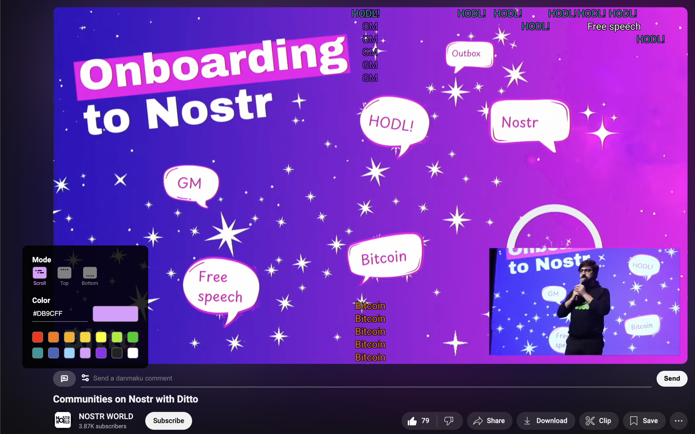

# danmakustr - 去中心化弹幕插件

> 一个基于 [nostr 协议](https://nostr.com/)的 chrome 弹幕插件，支持 YouTube

因为现在使用的人比较少，所以弹幕也很少。所以做了个简单的[网页](https://danmaku.nostr-relay.app/)展示所有的弹幕，方便大家看到别人的弹幕。如果你觉得哪条弹幕有趣，可以点击跳转到对应的视频使用插件进行回复。

## 截图



## 安装

### 从 Chrome 商店安装

[Chrome Web Store](https://chromewebstore.google.com/detail/danmakustr/mohbdimkkpjjibdfipfajpgpmegnglhb)

### 从源码安装

1. clone 本仓库并进入文件夹

```bash
git clone https://github.com/CodyTseng/danmakustr.git
cd danmakustr
```

2. 安装依赖并构建

```bash
npm install
npm run build
```

3. 打开 chrome 浏览器，进入 `chrome://extensions/`
4. 打开开发者模式
5. 点击 `加载已解压的扩展程序`
6. 选择打包好的文件夹 `build`
7. 打开 YouTube 发送你的第一条 nostr 弹幕吧！

## 中继器

中继器是用于存储和传播 nostr 事件的服务，每一条弹幕都是一个 nostr 事件。如果你想自己保存和传播弹幕，可以自己搭建一个中继器。以下是我的两个中继器实现：

- [nostr-relay-tray](https://github.com/CodyTseng/nostr-relay-tray): 一个桌面端中继器，使用 electron 实现，双击即可运行。适合非技术人员使用。
- [nostr-relay-nestjs](https://github.com/CodyTseng/nostr-relay-nestjs): 一个更适合在服务器上运行的 nostr 中继器，使用 nodejs + PostgreSQL 实现。

nostr 社区中还有很多[其他中继器实现](https://github.com/aljazceru/awesome-nostr#relays)

## TODO

- [x] 可编辑中继列表
- [x] 支持自定义弹幕颜色和显示模式
- [ ] 支持 NIP-07
- [ ] 支持给弹幕点赞
- [ ] 支持查看历史弹幕
- [ ] 支持下载视频弹幕
- [ ] 支持更多平台
- [ ] ...

## Donate

If you like this project, you can buy me a coffee :) ⚡️ codytseng@getalby.com ⚡️

## License

MIT
